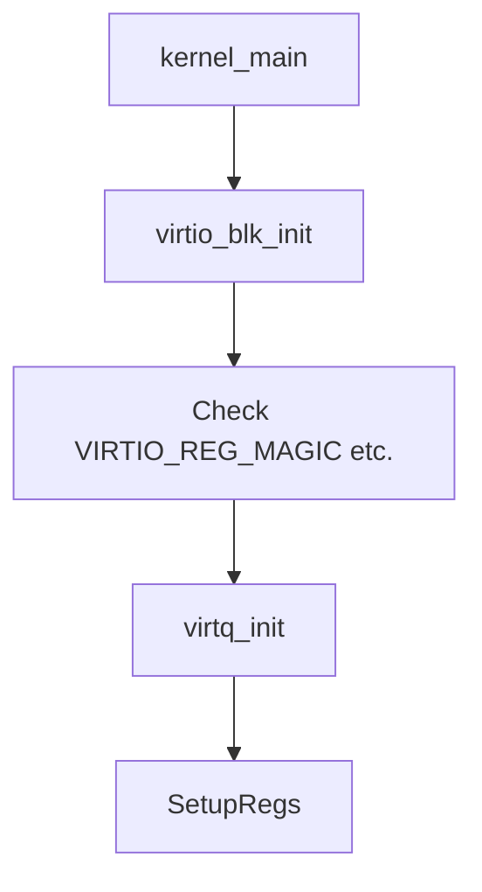
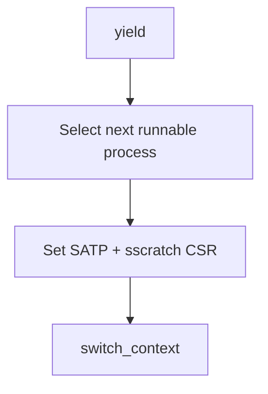
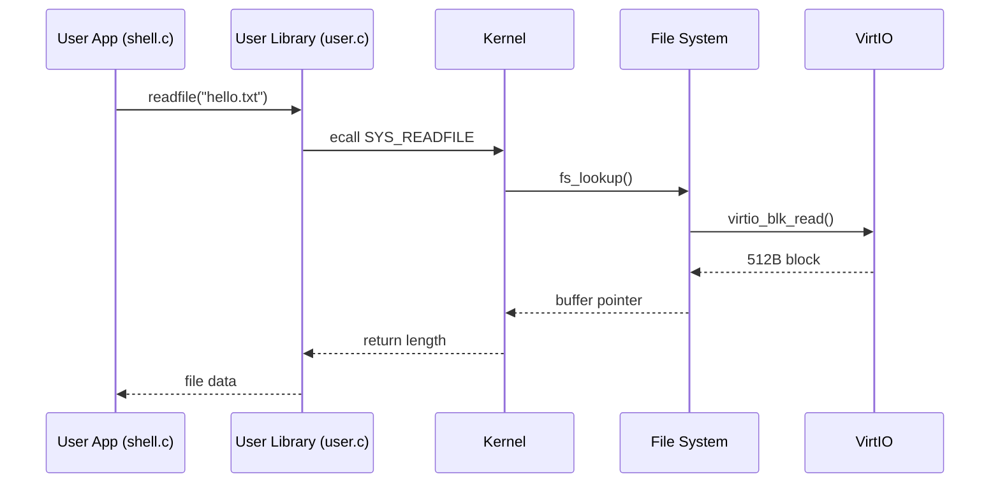

# 🧠 RISC-V 미니멀 OS 아키텍처 요약

## 📦 전체 구조 개요

```mermaid
graph TD
    subgraph 사용자 영역
        shell[Shell (shell.c)]
        userlib[User Library (user.c, user.h)]
    end

    subgraph 커널 영역
        kernel[Kernel (kernel.c)]
        common[Common (common.c, common.h)]
        virtio[VirtIO Driver]
        fs[File System]
    end

    subgraph 빌드 & 실행
        build[Build Script (run.sh)]
        qemu[QEMU 실행 환경]
    end

    shell --> userlib
    userlib -->|syscall| kernel
    kernel --> fs
    kernel --> virtio
    kernel --> common
    build --> shell
    build --> kernel
    build --> qemu
```

---

## 🔁 커널 부트 및 실행 흐름

```mermaid
graph TD
    Boot[boot.s] -->|Set SP| kernel_main
    kernel_main --> InitVirtio[virtio_blk_init()]
    InitVirtio --> InitFS[fs_init()]
    InitFS --> IdleProc[create_process(NULL, 0)]
    IdleProc --> ShellProc[create_process(shell.bin)]
    ShellProc --> yield
```

---

## 🧰 주요 컴포넌트 기능 흐름

### 🎯 시스템 콜 처리 흐름

```mermaid
graph TD
    UserApp --> Syscall[ecall (user.c)]
    Syscall --> Trap[kernel_entry -> handle_trap()]
    Trap --> handle_syscall
    handle_syscall -->|SYS_PUTCHAR| putchar
    handle_syscall -->|SYS_GETCHAR| getchar
    handle_syscall -->|SYS_EXIT| process_exit
    handle_syscall -->|SYS_READFILE / SYS_WRITEFILE| fs_lookup --> fs_flush
```

### 📁 파일 시스템 구조

```mermaid
graph TD
    files[file[] in memory] --> fs_flush
    fs_flush -->|tar format| disk[512B 섹터 배열]
    disk --> virtio[virtio-blk write]
```

### 💿 VirtIO 디바이스 초기화 흐름



### 🧵 프로세스 컨텍스트 스위칭



---

## 🖥 쉘 명령 구조 (user-space)

```mermaid
graph TD
    shell_main[main in shell.c] --> ParseCommand
    ParseCommand -->|hello| print_hello
    ParseCommand -->|exit| exit()
    ParseCommand -->|readfile| readfile()
    ParseCommand -->|writefile| writefile()
```

---

## 🔄 컴포넌트 간 상호작용 (Call Graph)

```mermaid
graph TD
    shell --> user_start[start()]
    user_start --> user_main[main() in shell.c]
    user_main --> syscall_exit
    user_main --> syscall_getchar
    user_main --> syscall_readfile
    user_main --> syscall_writefile

    syscall_exit --> kernel_trap
    syscall_getchar --> kernel_trap
    syscall_readfile --> kernel_trap
    syscall_writefile --> kernel_trap

    kernel_trap --> handle_syscall
    handle_syscall --> fs_read
    handle_syscall --> fs_write
    fs_read --> virtio_blk
    fs_write --> virtio_blk
```

---

## ⏱ 타이밍 시퀀스 다이어그램 (System Call: readfile)



---

## ✅ 특이 사항

- 커널과 유저가 **완전히 분리된 바이너리** (`shell.elf`, `kernel.elf`)
- 커널은 유저 프로세스를 위한 **MMU 세팅**과 가상 메모리 매핑 수행
- VirtIO 블록 디바이스를 통해 tar 기반 간이 파일 시스템 사용
- 커널 스택과 유저 스택을 철저히 분리

---

## 📂 빌드 및 실행 (run.sh)

```bash
$ ./run.sh
```

- `shell.c + user.c + common.c` → `shell.elf` → `shell.bin`
- `kernel.c + common.c + shell.bin.o` → `kernel.elf`
- QEMU에서 `kernel.elf` 실행
