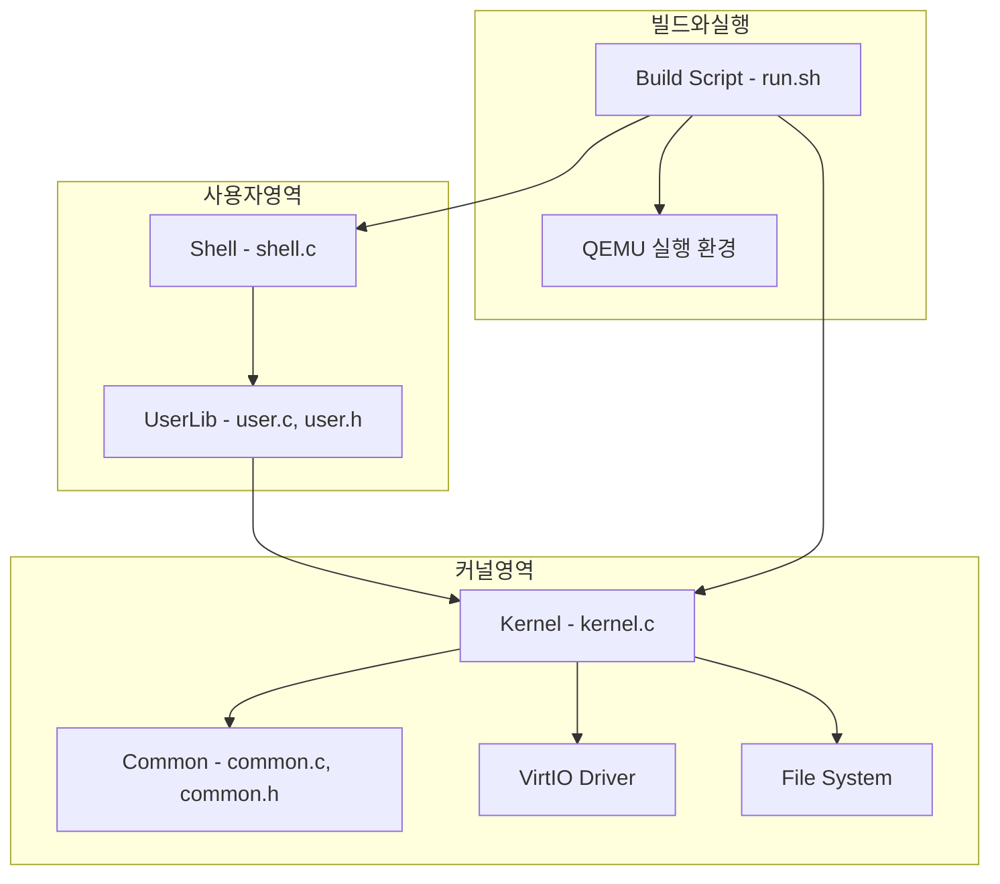
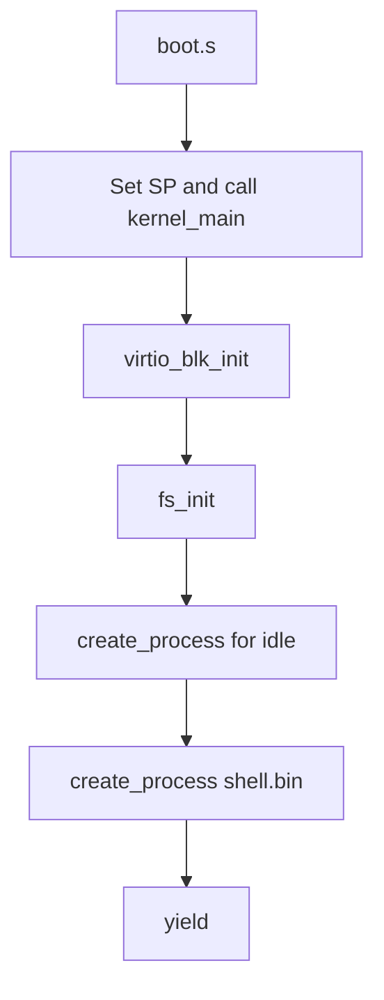
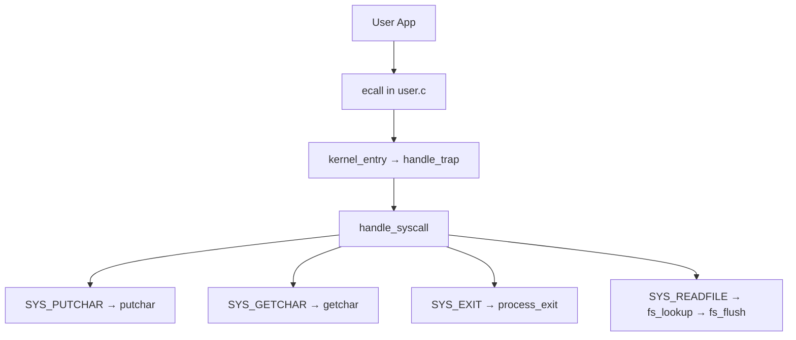
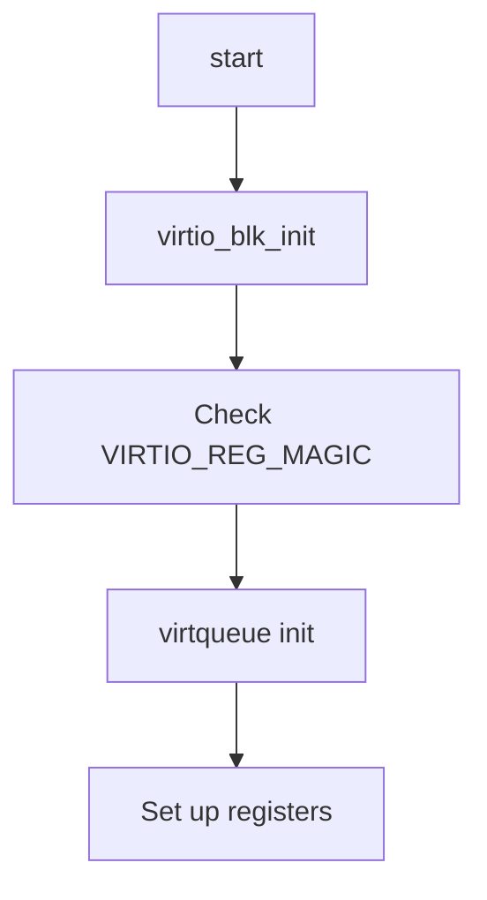
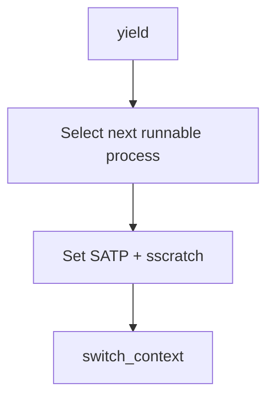
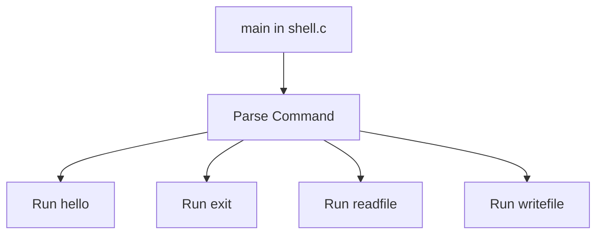
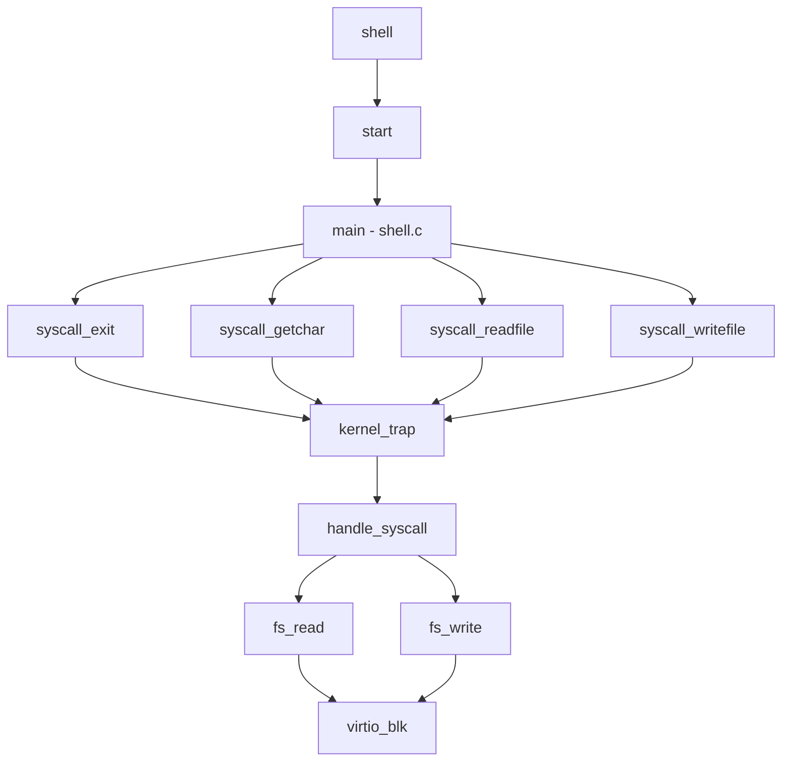
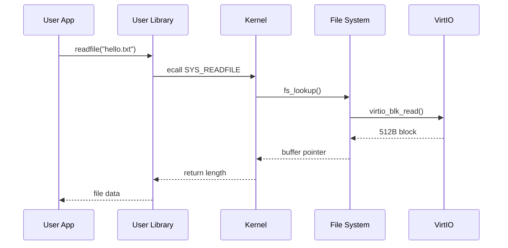

# 🧠 RISC-V 미니멀 OS 아키텍처 요약

## 📦 전체 구조 개요



---

## 🔁 커널 부트 및 실행 흐름



---

## 🧰 주요 컴포넌트 기능 흐름

### 🎯 시스템 콜 처리 흐름



### 📁 파일 시스템 구조

```mermaid
graph TD
    memfile[file memory array] --> flush[flush to disk]
    flush --> block[disk block (tar format)]
    block --> virtioio[virtio-blk write]
```

### 💿 VirtIO 디바이스 초기화 흐름



### 🧵 프로세스 컨텍스트 스위칭



---

## 🖥 쉘 명령 구조 (user-space)



---

## 🔄 컴포넌트 간 상호작용 (Call Graph)



---

## ⏱ 타이밍 시퀀스 다이어그램 (System Call: readfile)



---

## ✅ 특이 사항

- 커널과 유저가 **완전히 분리된 바이너리** (`shell.elf`, `kernel.elf`)
- 커널은 유저 프로세스를 위한 **MMU 세팅**과 가상 메모리 매핑 수행
- VirtIO 블록 디바이스를 통해 tar 기반 간이 파일 시스템 사용
- 커널 스택과 유저 스택을 철저히 분리

---

## 📂 빌드 및 실행 (run.sh)

```bash
$ ./run.sh
```

- `shell.c + user.c + common.c` → `shell.elf` → `shell.bin`
- `kernel.c + common.c + shell.bin.o` → `kernel.elf`
- QEMU에서 `kernel.elf` 실행

