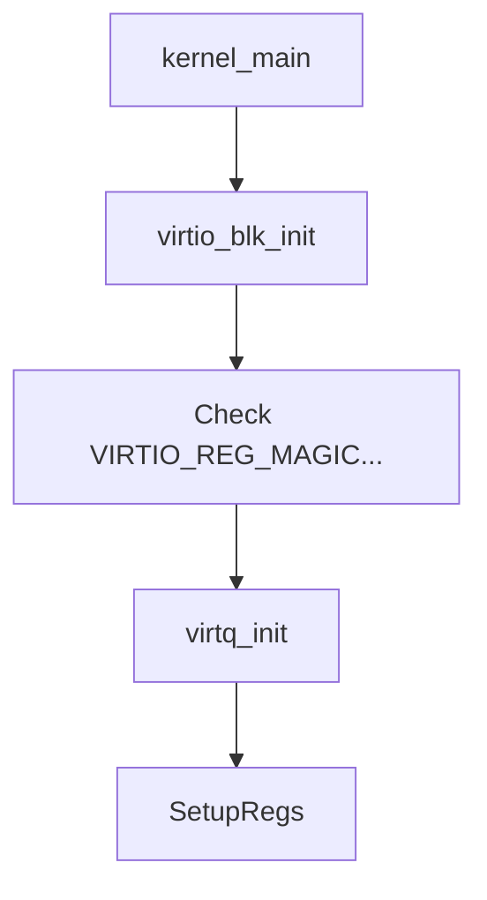
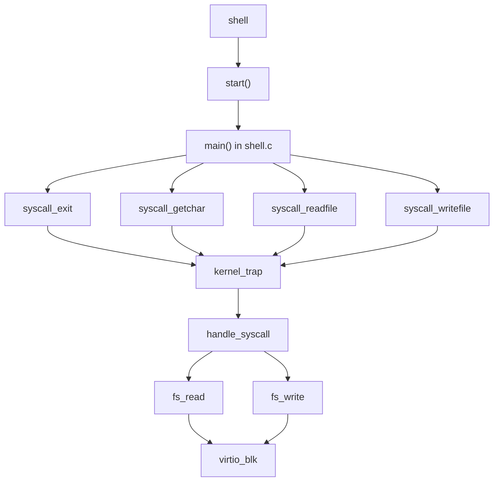

# 🧠 RISC-V 미니멀 OS 아키텍처 요약

## 📦 전체 구조 개요

```mermaid
graph TD
    subgraph 사용자영역
        shell["Shell<br/>(shell.c)"]
        userlib["UserLib<br/>(user.c, user.h)"]
    end

    subgraph 커널영역
        kernel["Kernel<br/>(kernel.c)"]
        common["Common<br/>(common.c, common.h)"]
        virtio["VirtIO Driver"]
        fs["File System"]
    end

    subgraph 빌드와실행
        build["Build Script<br/>(run.sh)"]
        qemu["QEMU<br/>환경"]
    end

    shell --> userlib
    userlib -->|"syscall"| kernel
    kernel --> fs
    kernel --> virtio
    kernel --> common
    build --> shell
    build --> kernel
    build --> qemu
```

---

## 🔁 커널 부트 및 실행 흐름

```mermaid
graph TD
    Boot[boot.s] -->|"Set SP"| kernel_main
    kernel_main --> InitVirtio[virtio_blk_init()]
    InitVirtio --> InitFS[fs_init()]
    InitFS --> IdleProc[create_process(NULL, 0)]
    IdleProc --> ShellProc[create_process(shell.bin)]
    ShellProc --> yield
```

---

## 🧰 주요 컴포넌트 기능 흐름

### 🎯 시스템 콜 처리 흐름

```mermaid
graph TD
    UserApp --> Syscall["ecall (user.c)"]
    Syscall --> Trap["kernel_entry → handle_trap()"]
    Trap --> handle_syscall
    handle_syscall -->|"SYS_PUTCHAR"| putchar
    handle_syscall -->|"SYS_GETCHAR"| getchar
    handle_syscall -->|"SYS_EXIT"| process_exit
    handle_syscall -->|"SYS_READFILE / SYS_WRITEFILE"| fs_lookup
    fs_lookup --> fs_flush
```



### 📁 파일 시스템 구조

```mermaid
graph TD
    files["file[] in memory"] --> fs_flush
    fs_flush -->|"tar format"| disk["512B 섹터 배열"]
    disk --> virtio["virtio-blk write"]
```



### 💿 VirtIO 디바이스 초기화 흐름



### 🧵 프로세스 컨텍스트 스위칭


---

## 🖥 쉘 명령 구조 (user-space)

```mermaid
graph TD
    shell_main["main in shell.c"] --> ParseCommand
    ParseCommand -->|"hello"| print_hello
    ParseCommand -->|"exit"| exit()
    ParseCommand -->|"readfile"| readfile()
    ParseCommand -->|"writefile"| writefile()
```

---

## 🔄 컴포넌트 간 상호작용 (Call Graph)



---

## ⏱ 타이밍 시퀀스 다이어그램 (System Call: readfile)


---

## ✅ 특이 사항

- 커널과 유저가 **완전히 분리된 바이너리** (`shell.elf`, `kernel.elf`)
- 커널은 유저 프로세스를 위한 **MMU 세팅**과 가상 메모리 매핑 수행
- VirtIO 블록 디바이스를 통해 tar 기반 간이 파일 시스템 사용
- 커널 스택과 유저 스택을 철저히 분리

---

## 📂 빌드 및 실행 (run.sh)

```bash
$ ./run.sh
```

- `shell.c + user.c + common.c` → `shell.elf` → `shell.bin`
- `kernel.c + common.c + shell.bin.o` → `kernel.elf`
- QEMU에서 `kernel.elf` 실행

