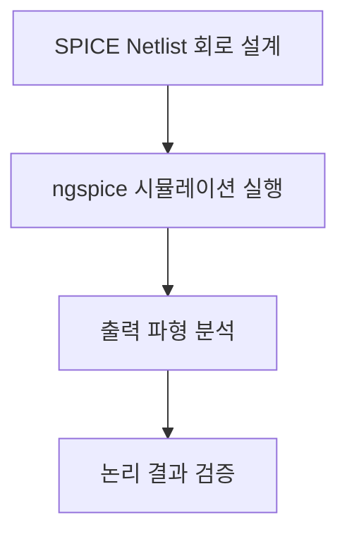

# 🔌 SPICE 기반 디지털 논리 회로 시뮬레이션 프로젝트

이 프로젝트는 SPICE(Netlist 기반 시뮬레이션 도구)를 활용하여 다양한 디지털 논리 회로를 트랜지스터 레벨에서 모델링하고,  
논리 동작 및 시간 특성을 실험적으로 확인하는 데 목적이 있습니다.

---

## 📁 주요 회로 구성 파일

| 파일명               | 설명                                    |
|----------------------|-----------------------------------------|
| `and.sp`             | AND 게이트 회로                         |
| `or.sp`              | OR 게이트 회로                          |
| `nand.sp`            | NAND 게이트 회로                        |
| `nor.sp`             | NOR 게이트 회로                         |
| `DFF.spice`          | D 플립플롭(D Flip-Flop) 구현 및 타이밍 분석 |
| `fulladderA.sp`      | Full Adder (설계안 A)                   |
| `fulladderB.sp`      | Full Adder (설계안 B)                   |
| `up_down_counter.sp` | Up/Down 카운터 회로 구현 및 검증         |

---

## 🧪 실험 목적

- SPICE 시뮬레이터를 통한 디지털 회로의 트랜지스터 수준 설계 검증
- 기본 논리 게이트 AND, OR, NAND, NOR의 CMOS 기반 동작 확인
- 순차 논리 회로(D 플립플롭, 카운터)의 시간적 특성 검토
- Full Adder의 구조적 차이(A형 vs B형)에 따른 파형 비교

---

## 🔁 시뮬레이션 흐름도

---

## ⚙️ 사용 도구

- **NGSPICE** 또는 **LTspice**: SPICE 시뮬레이션 실행
- **GTKWave**, **LTspice Viewer**: 파형 출력 시각화

---

## ✅ 기대 효과

- 디지털 회로의 논리 동작을 트랜지스터 수준에서 학습
- 복합 회로(Adder, Counter)의 시계열 동작 이해
- CMOS 기반 회로 설계 경험 및 SPICE 실무 적용 능력 향상

