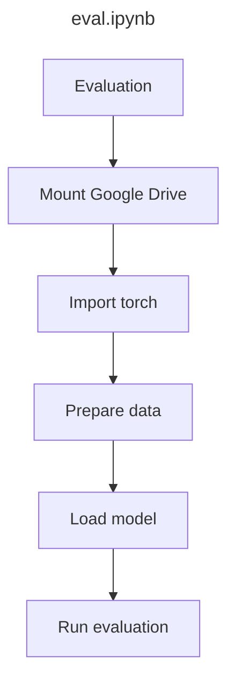

```mermaid
---
title : train.ipynb
---
graph TD
    A0["Mask augmentation"]
    A1["Mount Google Drive"]
    A2["Change directory to detect_mask"]
    A3["Unzip data.zip"]
    A4["Clone MaskTheFace repo"]
    A5["Install cmake"]
    A6["Change directory to MaskTheFace"]
    A7["Print working directory"]
    A8["Run mask_the_face.py (1)"]
    A9["Run mask_the_face.py (2)"]
    A10["Import wandb"]

    B0["Prepare Data for Training"]
    B1["Import packages"]
    B2["Define transforms"]
    B3["Define train_path"]
    B4["Check data loader"]

    C0["Prepare Model"]
    C1["Assign device"]
    C2["Import model packages"]
    C3["Load and modify model"]

    D0["Training"]
    D1["Import torch"]
    D2["Define train_model()"]
    D3["Define val_model()"]
    D4["Train & validate function"]
    D5["Set hyperparameters"]
    D6["Save trained model"]

    A0 --> A1 --> A2 --> A3 --> A4 --> A5 --> A6 --> A7 --> A8 --> A9 --> A10
    A10 --> B0
    B0 --> B1 --> B2 --> B3 --> B4 --> C0
    C0 --> C1 --> C2 --> C3 --> D0
    D0 --> D1 --> D2 --> D3 --> D4 --> D5 --> D6

```

```mermaid
---
title: eval.ipynb
---
graph TD
    E0["Evaluation"]
    E1["Mount Google Drive"]
    E2["Import torch"]
    E3["Prepare data"]
    E4["Load model"]
    E5["Run evaluation"]

    E0 --> E1 --> E2 --> E3 --> E4 --> E5

```