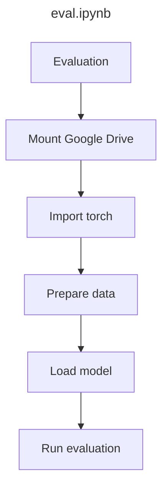

```mermaid
---
title : train.ipynb
---
graph TD
    A0["Mask augmentation"]
    A1["Mount Google Drive"]
    A2["Change directory to detect_mask"]
    A3["Unzip data.zip"]
    A4["Clone MaskTheFace repo"]
    A5["Install cmake"]
    A6["Change directory to MaskTheFace"]
    A7["Print working directory"]
    A8["Run mask_the_face.py (1)"]
    A9["Run mask_the_face.py (2)"]
    A10["Import wandb"]

    B0["Prepare Data for Training"]
    B1["Import packages"]
    B2["Define transforms"]
    B3["Define train_path"]
    B4["Check data loader"]

    C0["Prepare Model"]
    C1["Assign device"]
    C2["Import model packages"]
    C3["Load and modify model"]

    D0["Training"]
    D1["Import torch"]
    D2["Define train_model()"]
    D3["Define val_model()"]
    D4["Train & validate function"]
    D5["Set hyperparameters"]
    D6["Save trained model"]

    A0 --> A1 --> A2 --> A3 --> A4 --> A5 --> A6 --> A7 --> A8 --> A9 --> A10
    A10 --> B0
    B0 --> B1 --> B2 --> B3 --> B4 --> C0
    C0 --> C1 --> C2 --> C3 --> D0
    D0 --> D1 --> D2 --> D3 --> D4 --> D5 --> D6

```

# 📘 train.ipynb 코드 설명

## 0. Mask Augmentation
- Google Drive를 마운트하고 작업 디렉토리를 변경합니다.
- `data.zip`을 압축 해제하고, `MaskTheFace` 레포를 클론합니다.
- `mask_the_face.py` 스크립트를 실행하여 이미지에 마스크를 합성합니다.

## 1. Prepare Data for Training
- 필요한 라이브러리를 임포트합니다.
- 이미지 전처리를 위한 transform을 정의합니다.
- `ImageFolder`와 `DataLoader`를 통해 학습 데이터를 로딩합니다.

## 2. Prepare Model
- `torch.device`로 CPU 또는 GPU 설정을 합니다.
- 사전 학습된 모델(e.g., ResNet)을 불러오고 클래스 수에 맞게 마지막 레이어를 수정합니다.

## 3. Training
- `train_model()` 함수로 학습을 수행합니다.
- `val_model()` 함수로 검증을 수행합니다.
- 학습 결과를 저장하고, 로그를 출력하거나 `wandb`로 기록합니다.

---

# 📕 eval.ipynb 코드 설명

## 전체 흐름
- Google Drive를 마운트하고, 학습 환경과 동일한 설정을 합니다.
- 저장된 모델(`.pth`)을 불러옵니다.
- 검증 데이터셋을 로딩하고 `val_model()` 함수를 통해 평가를 수행합니다.
- 평가 결과(loss, accuracy 등)를 출력합니다.

---

# ✅ 요약 비교

| 항목       | train.ipynb                          | eval.ipynb                          |
|------------|--------------------------------------|-------------------------------------|
| 목적       | 모델 학습 및 저장                    | 저장된 모델 불러오기 및 평가        |
| 데이터     | 마스크 합성 데이터 포함              | 학습과 동일한 형식의 검증 데이터     |
| 주요 함수  | `train_model`, `val_model`, `save`   | `val_model`                         |
| 출력       | 학습 로그, 모델 파일 (`.pth`)        | 평가 결과 (loss, accuracy 등)       |
