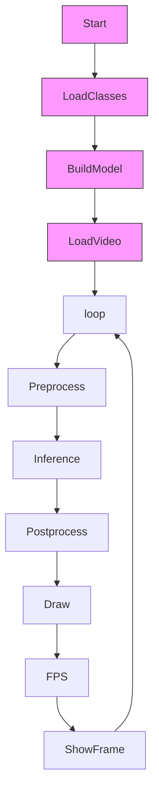

# YOLOv5 ONNX Inference Pipeline

## 🎯 Overview
This repository contains a real-time object detection pipeline using YOLOv5 exported to ONNX format. It includes performance profiling and CUDA/CPU fallback support using ONNX Runtime.

---

## 🧰 Structure
| Function | Description |
|----------|-------------|
| `build_model()` | Load ONNX model with CUDA/CPU fallback |
| `detect()` | Forward pass through ONNX session |
| `wrap_detection()` | Confidence filtering + NMS |
| `format_yolov5()` | Resize + padding for 640x640 YOLO input |

---

## 📽️ Runtime Flow

> ⚠️ Mermaid diagrams may not render in all Markdown viewers. Use GitHub or Live Editor to preview.



---

## 📊 Performance Profiling
Performance time is split into:
- `PreProcessTime`: image capture and preprocessing
- `proCessTime`: inference time
- `outPutTime`: display/rendering time

```python
print(f"Pre: {PreProcessTime/total:.2f}, Infer: {proCessTime/total:.2f}, Out: {outPutTime/total:.2f}, Total: {total:.2f}")
```

---

## 🖥 CUDA Support
```bash
$ python3 detect.py cuda  # Run with GPU
$ python3 detect.py       # Run with CPU
```

---

## 📁 File Structure
```
├── detect.py
├── config_files/
│   ├── best.onnx
│   └── classes.txt
└── sample.mp4
```

---

## 📌 License
MIT or personal use only.

