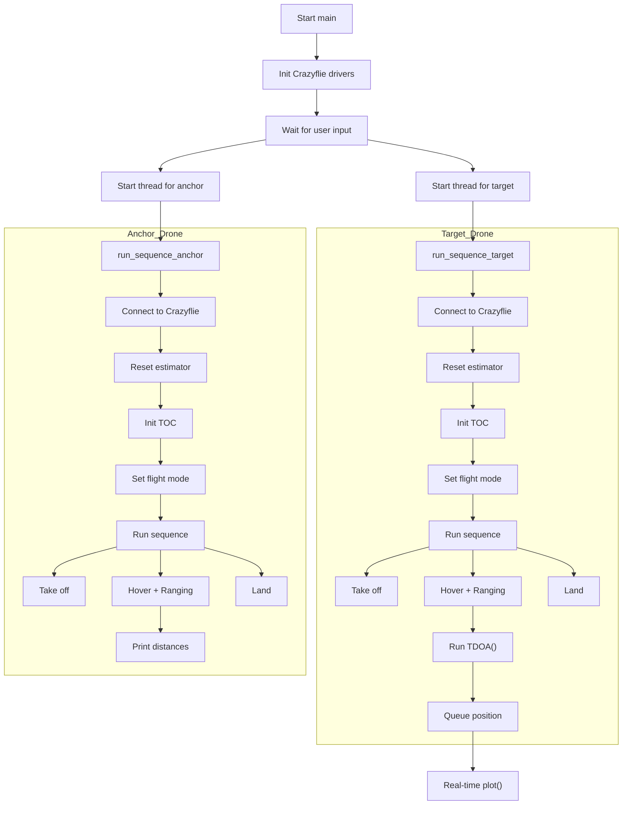

# 캡스톤 디자인
## 과제 1
### 다이어그램

## 전체 흐름 요약
# 🛸 Crazyflie 기반 거리 측정 및 위치 추정 시스템

## 📌 시스템 개요

| 구성 요소 | 설명 |
|-----------|------|
| **드론 수** | 2대 (`target`, `anchor`) |
| **통신 방식** | `radio://` URI를 통한 무선 연결 |
| **거리 측정 방식** | TOF (Time of Flight) 센서 기반 `ranging.distanceN` |
| **위치 추정 방식** | TDOA 기반 2D trilateration |
| **위치 필터링** | **Crazyflie 내장 Kalman 필터 사용 중** |
| **시각화** | `matplotlib` 기반 실시간 궤적 플롯 |
| **구현 언어** | Python + `cflib` 라이브러리 |

---

## 🧠 전체 흐름 요약

### 1. 초기화
- Crazyflie 드라이버 초기화
- 사용자 입력 대기
- 드론 2대를 각각 스레드로 실행

### 2. 각 드론의 제어 흐름 (`run_sequence_target`, `run_sequence_anchor`)
- `SyncCrazyflie`로 드론 연결
- **Kalman 필터 초기화** (`kalman.resetEstimation`)
- 거리 수집 로그 등록 (`TOC`)
- 시퀀스 수행 (`take_off → hovering → land`)

### 3. 드론 비행 시퀀스 (`sequence`)
- 드론 이륙 (`take_off`)
- hovering 상태에서 TOF 거리 측정 수행
- 거리 데이터를 `TDOA()`에 넣어 위치 추정 (추후 확장 가능)
- 추정된 좌표를 `data_queue`에 저장하여 시각화
- 드론 착륙 (`land`)

### 4. 위치 추정 알고리즘 (`TDOA`)
- 3개의 기준점 위치와 거리(r1, r2, r3)를 바탕으로
- 선형 방정식을 풀어 2D 평면상의 위치를 추정

### 5. 실시간 시각화 (`plot`)
- `data_queue`로부터 좌표를 꺼내고
- `matplotlib` 3D 그래프로 실시간 궤적 갱신 (z=0)

---

## ✅ 주요 특징

- ✔️ **멀티 드론 제어**: `target`, `anchor`를 스레드로 병렬 제어
- ✔️ **내장 Kalman 필터 활용**: Crazyflie의 위치 추정기 초기화 및 수렴 체크 포함
- ✔️ **거리 기반 위치 추정**: TOF 거리 데이터를 기반으로 위치 계산 가능
- ✔️ **실시간 시각화 구조 내장**: 추정된 위치를 실시간 플로팅 가능
- ✔️ **확장 가능 구조**: ranging.distance6 이상 센서, 3D 추정도 가능

---

## ⚠️ 개선 사항

| 항목 | 설명 |
|------|------|
| `data` 객체 전역 사용 | 두 드론 스레드 간 충돌 위험 → 지역 객체(`toc`) 분리 필요 |
| `TOC.__init__()` 오류 | `key` 변수 미정의 상태 → `self.ID = key` 제거 또는 전달 |
| `plot()` 호출 누락 | 현재 주석 처리되어 있어 궤적 시각화 미작동 → 활성화 필요 |
| `TDOA()` 호출 미완성 | 위치 추정 함수 정의돼 있지만 실행되지 않음 → 연결 필요 |

---

## 🔁 향후 확장 방향

- 🧠 **위치 추정 개선**: 외부 Kalman, Particle Filter 등의 필터링 적용 실험
- 🌐 **멀티 앵커 확장**: ranging.distance6 이상 활용한 정밀 위치 추정
- 🧮 **3D 위치 추정**: 고도 정보 포함하여 `x, y, z` 위치 추정
- 💾 **데이터 저장**: 추정 결과를 CSV/Excel 등으로 저장

---

## 📎 관련 라이브러리

- [`cflib`](https://github.com/bitcraze/crazyflie-lib-python)
- `matplotlib`, `numpy`, `threading`, `pandas`
