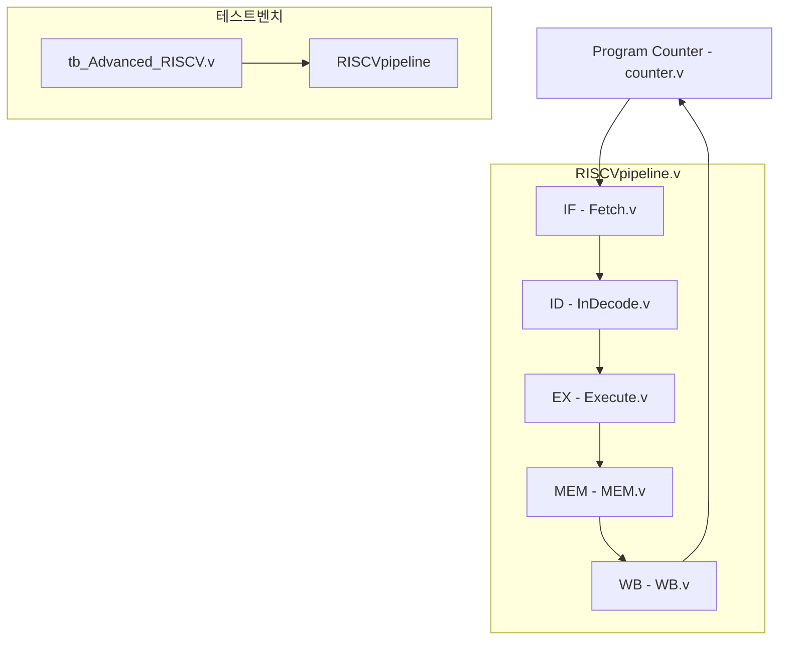

# 🧠 RISC-V 5단계 파이프라인 CPU 설계 프로젝트

Verilog를 기반으로 RISC-V 명령어를 처리하는 **5단계 파이프라인 CPU**를 설계한 프로젝트입니다.  
각 단계는 독립적인 모듈로 구성되어 있으며, 테스트벤치를 통해 명령어 수행을 검증합니다.

---

## 📦 프로젝트 개요

- **구현 언어**: Verilog HDL
- **설계 구조**: 5단계 파이프라인 (IF → ID → EX → MEM → WB)
- **시뮬레이션 환경**: Testbench(`tb_Advanced_RISCV.v`) 사용
- **상위 통합 모듈**: `RISCVpipeline.v`

---

## 🧩 모듈 구성도

---

## 🗂️ 주요 파일 설명

| 파일명                | 역할                             |
|-----------------------|----------------------------------|
| `Fetch.v`             | 명령어 메모리 접근, PC 계산       |
| `InDecode.v`          | 명령어 디코딩 및 레지스터 접근    |
| `Execute.v`           | 연산 수행(ALU)                   |
| `MEM.v`               | 데이터 메모리 접근               |
| `WB.v`                | 결과를 레지스터에 저장           |
| `counter.v`           | 프로그램 카운터 관리             |
| `RISCVpipeline.v`     | 파이프라인 상위 모듈             |
| `tb_Advanced_RISCV.v` | 전체 동작 검증용 테스트벤치       |

---

## ✅ 실행 방법

1. 시뮬레이션 도구(예: ModelSim, Vivado 등)에 프로젝트 파일을 로드합니다.
2. 상위 모듈로 `tb_Advanced_RISCV.v` 또는 `RISCVpipeline.v`를 선택하여 컴파일합니다.
3. 명령어 실행 흐름을 파형 또는 콘솔 출력으로 확인합니다.

---

## 💡 핵심 특징

- 5단계 파이프라인 구조로 명령어 병렬 처리
- 각 단계별 독립적 처리 및 명확한 데이터 흐름
- 테스트벤치를 통한 명령어 실행 검증
